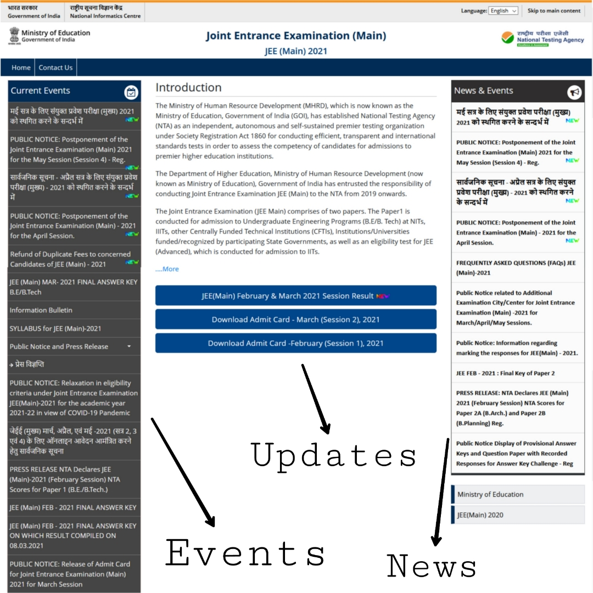

# JEE Updates API
JEE Updates API written in javascript to fetch latest data from [JEE Mains Website](https://jeemain.nta.nic.in/webinfo2021)



Must check out [@jee_updates_bot](https://t.me/jee_updates_bot) on Telegram based on this API

# Usage

## Current Events
  - This usually contains the current ongoing events
  - API Link :
`https://jee-updates-api.dvishal485.workers.dev/events`
  - Response Example :

```json
[
  {
    "name": "Information Bulletin",
    "new": false,
    "url": "https://jeemain.nta.nic.in/webinfo2021/File/GetFile?FileId=1&amp;LangId=P"
  },
  {
    "name": "PUBLIC NOTICE 28 July 2021 Sub: Conduct of JEE (Main) 2021 (Session-3) for concerned Candidates in The Flood Affected Districts of Kolhapur, Palghar, Ratnagiri, Raigadh, Sindhudurg, Sangli, and Satara in Maharashtra State - Reg.",
    "new": false,
    "url": "https://jeemain.nta.nic.in/webinfo2021/File/GetFile?FileId=52&amp;LangId=P"
  }
]
```

## Latest Updates
  - This usually includes the Admit Card and Result related content
  - API Link :
`https://jee-updates-api.dvishal485.workers.dev/status`
  - Response Example :
```json
 [
  {
    "name": "JEE(Main) 2021 Result (Session 3/ Session 2 / Session 1)",
    "new": true,
    "url": "https://ntaresults.nic.in/resultservices/JEEMain2021auth"
  }
]
```

## News & Events
  - This usually includes the current events and news
  - API Link :
`https://jee-updates-api.dvishal485.workers.dev/news`
  - Response Example :
```json
[
  {
    "name": "PRESS RELEASE06 August 2021Sub.:-NTA Declares JEE (Main)-2021 Session 3 NTA Scores for Paper 1 (B.E./B.Tech.)Reg.",
    "new": true,
    "url": "https://jeemain.nta.nic.in/webinfo2021/File/GetFile?FileId=56&amp;LangId=P"
  },
  {
    "name": "NATIONAL TESTING AGENCY JEE (Main) Session - 3,2021 FINAL ANSWER KEY ON WHICH RESULT COMPILEDON06.08.2021",
    "new": true,
    "url": "https://jeemain.nta.nic.in/webinfo2021/File/GetFile?FileId=55&amp;LangId=P"
  }
]
```

## Link Capture
  - This should be used if the website is changed for some certain amount of time for special purpose such as result uploading. This will capture all the links (including the hidden links) present in website which may contain important updates regarding Result / Admit Card release.
  - API Link :
`https://jee-updates-api.dvishal485.workers.dev/special`
  - Response Example :

### Note
  - The API is hosted with Cloudflare Worker and have a limit to its maximum usage, do not misuse the API.
  - To check if the link is working properly, one may fetch the [link](https://jee-updates-api.dvishal485.workers.dev/) `https://jee-updates-api.dvishal485.workers.dev/` and look for the 'alive' status
  - Must check out [@jee_updates_bot](https://t.me/jee_updates_bot) on Telegram based on this API